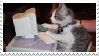

## Now shouldn't you be doing something

hi I'm makrcat and i code sometimes. 🌜

📬 • I check discord approximately once per 1-2 days

## Stack

art by sukinapan

### w o w﹗L a  n g u a  g e s

| Dev type       | language           | related/library       |
|----------------|------------------|-----------------------|
| Web dev!       |     |  |
| Programming     |    |   |
| Console |   | | 

### Stuff I kinda know

 
       

## Stats :D

<!---->

 

<!--
-->
